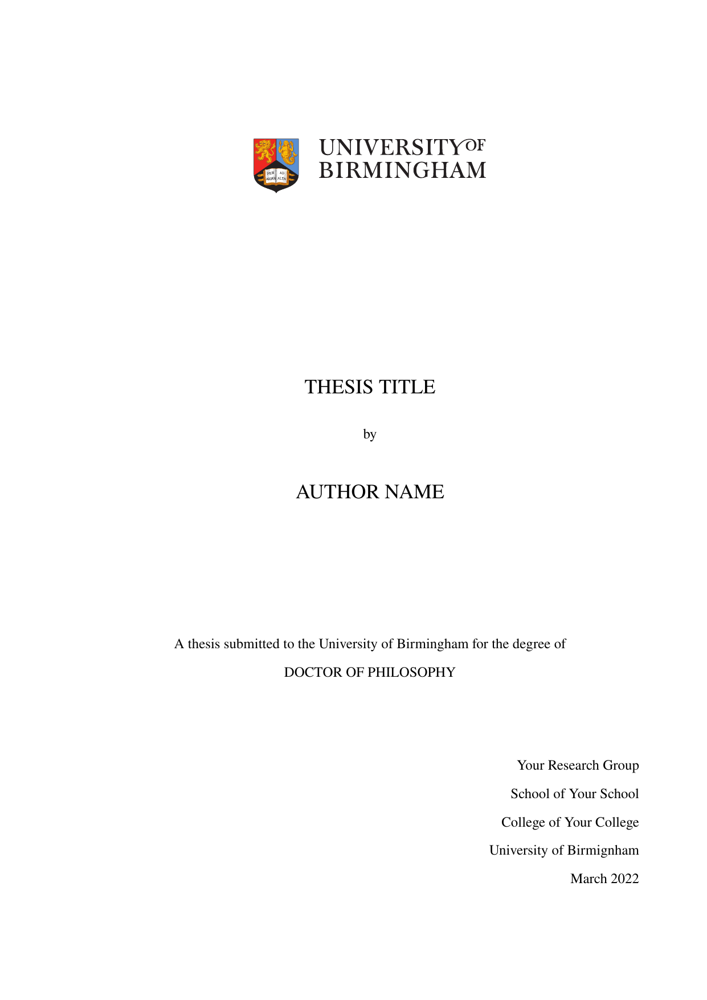

# uob-thesis-template

Simple LaTeX template following University of Birmingham thesis guidelines.

This template provides the `uobthesis.cls` LaTeX class, the `packages.sty` collection of packages for producing a neat thesis, and the `thesis.tex` template. Also included are example chapters, appendices, references, acronyms, and a glossary. These can be removed or edited depending on your requirements. The rights to `uob-logo.eps` belong to the University of Birmingham.



## Getting Started

The easiest way to get started is to import this template into Overleaf.

Alternatively, the PDF may be compiled locally on your machine in a GUI or using the scripts as a part of an up-to-date TeX installation. This may be done manually with `pdflatex` and `biber` (for the bibliography),

```bash
pdflatex thesis
biber thesis
pdflatex thesis
pdflatex thesis
```

or automatically with `latexmk`,

```bash
latexmk -pdf thesis.tex
```

To include a List of Acronyms and/or List of Terms in the front matter, the `glossaries` package is used with `makeglossaries`. You will also need to run the `makeglossaries` command if compiling manually,

```bash
pdflatex thesis
biber thesis
makeglossaries thesis
pdflatex thesis
pdflatex thesis
```

Alternatively, you could configure the `latexmk` command with a `.latexmkrc` file. Consider the following solution on [tex.stackexchange](https://tex.stackexchange.com/a/44316).

## Usage

The files provided and their usage are described below.

### `uobthesis.cls`

The `uobthesis` class provides the following commands in addition to the usual LaTeX `book` class commands,

* `\group` -- the name of your research group, e.g. `Sun, Stars and Exoplanets`
* `\school` -- the name of your school, e.g. `Physics and Astronomy`
* `\college` -- the name of your college, e.g. `Engineering and Physical Sciences`
* `\submitted` -- the month name and year in which the thesis is submitted
* `\logo` -- path to the UoB logo to display on the title page (optional)
* `\abstract` -- the thesis abstract
* `\acknowledgements` -- the thanks and acknowledgements
* `\dedication` -- the message of dedication (optional)
* `\maketitle` -- adds the title page, extending that of the `book` class to follow University guidelines
* `\makefrontmatter` -- adds the abstract, dedication, and acknowledgements

### `thesis.tex`

Add your details to the preamble with the `uobthesis` class commands. You can add additional macros and configuration in `packages.sty` or in the preamble. Additional resources such as the bibliography and glossary definitions are also added here.

The main document comprises front matter and main matter. Back matter (such as an index) is not included in the template.

The front matter contains the abstract, dedication, acknowledgements and tables of contents. The contents section may be edited to your preference (e.g. removing the glossaries, list of tables, or list of figures).

The main matter contains the chapters, bibliography, and appendices. You may write chapters in separate `.tex` files in the `chapters` directory, likewise for appendices. Then, they may be added using the `\include` command in the main matter.

### `packages.sty`

This file imports a collection of packages required for `thesis.tex`. Feel free to modify this to your own preference, but watch out for possible conflicts.

### `acronyms.tex` and `glossary.tex`

Edit these files by adding your own acronyms and glossary of terms if applicable to your thesis. See the `chapters/example.tex` for example usage.

### `references.bib`

Edit or replace this file with your own bibliography. Additional bibliography resources may be added with the `\addbibresource` command in the preamble.

## License

Copyright 2022 Alexander Lyttle.

This work may be distributed and/or modified under the conditions of the LaTeX Project Public License (LPPL) version 1.3 or later.

The latest version of this license is in https://www.latex-project.org/lppl.txt and version 1.3 or later is part of all distributions of LaTeX version 2005/12/01 or later.

This work consists of the files `uobthesis.cls`, `packages.sty`, and `thesis.tex`.
